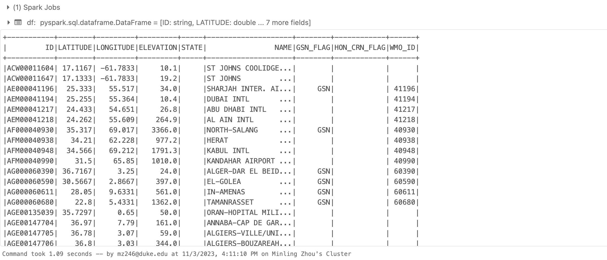
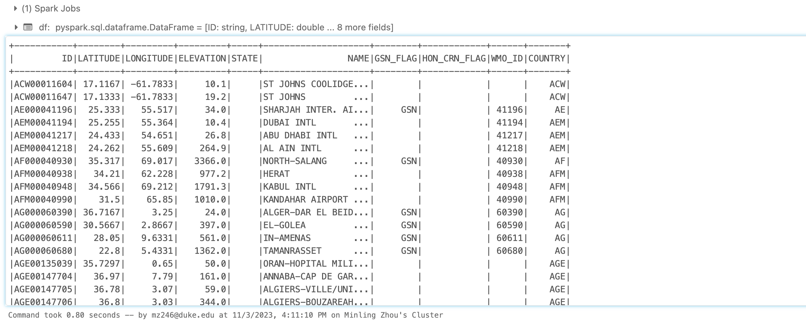
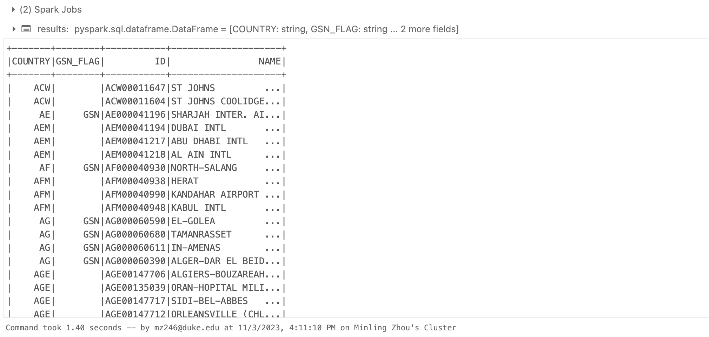

# PySpark
PySpark Data Processing

## Overview

`Bigdata.py`` - PySpark script to read a fixed-width file from Azure Blob Storage, extract substrings, and convert the resulting RDD to a PySpark DataFrame

This script was export from Azure Databrick Notebook. It reads a fixed-width file from Azure Blob Storage, extracts substrings using PySpark's withColumn() function, and converts the resulting RDD to a PySpark DataFrame using toDF(). It then uses PySpark's regexp_extract() function to extract non-numeric characters from the ID column, creates a temporary view of the DataFrame using createOrReplaceTempView(), and runs a SQL query on the view using spark.sql() to group the data by country, GSN flag, ID, and name, and order the results by country.

## Requirements

* Python 3.x
* PySpark
* Azure Blob Storage account
* Azure Databricks

## Usage

### Create an Azure Blob Storage account and container. For more information, see Create an Azure Blob Storage account and Create a container in Azure Blob Storage.

Some of the data source files are big in size, in such case you may need to use Azure Blob Storage to store the data source files.

### Upload the fixed-width file to the container. For more information, see Upload a block blob to Azure Blob Storage.

In order to access the data source files, you need to download the access key from Azure Portal.

### Set the container_name and storage_account variables in the script to the name of your Azure Blob Storage container and storage account, respectively.

```python
# Set the Blob storage account key and container name
storage_account = "***"
storage_account_key = "***"
container_name = "***"
```
### Set the file_name variable in the script to the name of the fixed-width file you want to read.

```python
# Set the CSV file name and path
file_name = "ghcnd-stations.txt"
file_path = (
    f"wasbs://{container_name}@{storage_account}.blob.core.windows.net/{file_name}"
)
positions = [
    (1, 11),
    (13, 20),
    (22, 30),
    (32, 37),
    (39, 40),
    (42, 71),
    (73, 75),
    (77, 79),
    (81, 85),
]
```

### Create the schema for the DataFrame.

```python
# Read the fixed-width file into a PySpark DataFrame and extract substrings using withColumn()
df = spark.read.text(file_path)
for i, (start, end) in enumerate(positions):
    df = df.withColumn(f"col{i + 1}", df.value.substr(start, end - start + 1))
df = df.selectExpr(
    "col1 as ID",
    "CAST(col2 AS double) AS LATITUDE",
    "CAST(col3 AS double) AS LATITUDE",
    "CAST(col4 AS double) AS ELEVATION",
    "col5 AS STATE",
    "col6 AS NAME",
    "col7 AS GSM_FLAG",
    "col8 AS HCN_CRN_FLAG",
    "col9 AS WMO_ID",
)
```

### Convert the resulting RDD to a PySpark DataFrame using toDF().

```python
# Convert the resulting RDD to a PySpark DataFrame using toDF()
df = df.rdd.map(lambda row: tuple(row)).toDF(schema=file_schema)

# Display the contents of the DataFrame
df.show()
```
Output:



## SQL Query

### Use PySpark's regexp_extract() function to extract non-numeric characters from the ID column.

```python
# COMMAND ----------

from pyspark.sql.functions import regexp_extract

# Define the regex pattern to extract non-numeric characters until the first number
pattern = "^[^0-9]+"

# Extract the non-numeric characters present in the ID column
df = df.withColumn("COUNTRY", regexp_extract(df.ID, pattern, 0))
```

Output:


### Create a temporary view of the DataFrame using createOrReplaceTempView().

```python
# COMMAND ----------

df.createOrReplaceTempView("table_name")
results = spark.sql("SELECT COUNTRY, GSN_FLAG, ID, NAME FROM table_name GROUP BY GSN_FLAG, COUNTRY, ID, NAME ORDER BY COUNTRY")
results.show()
```

Output:

